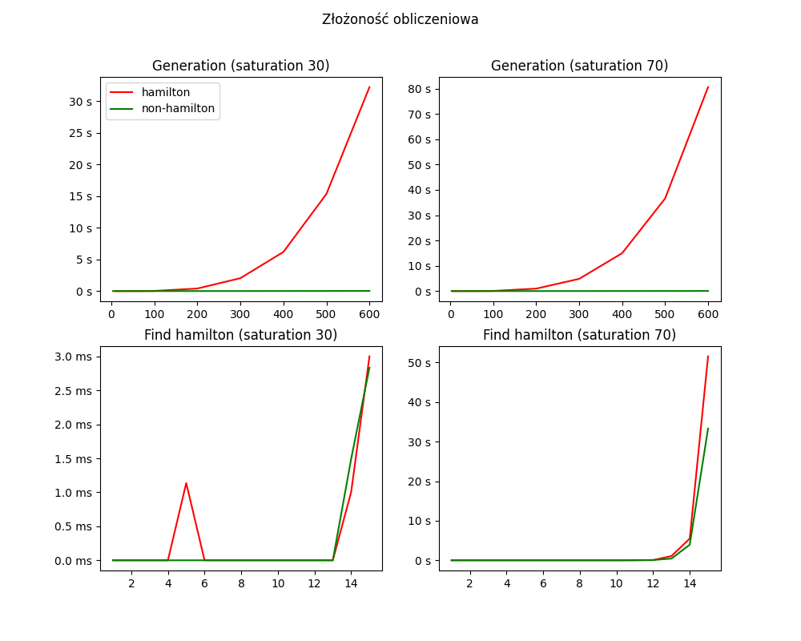

# Algorytmy z powracaniem

# Wstęp

Algorytmy z powracaniem to typ algorytmów, który stopniowo generuje
kandydatów na rozwiązanie, jednak gdy znaleziony kandydat nie nadaje się
na rozwiązanie, algorytm powraca do punktu gdzie może znaleźć inne
rozwiązanie. Projekt skupia się na dwóch algorytmach z powracaniem:
algorytmie znajdowania ścieżki Hamiltona i algorytmie znajdowania cyklu
Eulera. Celem ćwiczenia jest wyjaśnienie ich działania, analiza
efektywności, złożoności obliczeniowej oraz zrozumienie ograniczeń w ich
wykorzystaniu. Testy benchmark zostały wykonane na komputerze Apple
Macbook Air z procesorem M2.

**Projekt dostępny jest w całości na platofrmie
[Github](https://github.com/Skamlo/AiSD-Euler-and-Hamilton ).**

# Tworzenie grafu

Graf można utworzyć na dwa sposoby. Dostępne są opcje generowania grafu hamiltonowskiego $-hamilton$ i niehamiltonowskiego $-nonhamilton$. Przy tworzeniu grafu zdefiniować możemy liczbę jego wierzchołków oraz saturację.

```
nodes> 5
saturation>40

action> print
1> 2 4
2> 1 3
3> 2 4
4> 1 3
5>
```

```
nodes> 5
saturation>70

action> print
1> 2 4 5
2> 1 5
3> 4 5
4> 1 3 5
5> 1 2 3 4
```

# Badanie efektywności algorytmów

W programie zaimplementowane są reprezentacje macierzy incydencji oraz
listy następników. Reprezentacja macierzowa jest przydatna przy
algorytmie szukania scieżki Hamiltona, ponieważ łatwo możemy operować na
krawędziach. Reprezentacja listowa zaś, znajduje zastosowanie w szukaniu
cyklu Eulera. Printowanie grafu zaimplementowane jest dla obu
reprezentacji. Eksportowanie do TiKZ opiera się jednak na postaci
macierzowej.

<br>
<p align="center">
    
</p>
<br><br>

Benchmark został zaimplementowany w języku Bash oraz za pomocą
biblioteki std::chrono, zaś sama wizualizacja została wykonana za pomocą
biblioteki Matplotlib. Implementacja mierzenia czasu została
przesatawiona poniżej.

``` c
    const auto start{std::chrono::high_resolution_clock::now()};
    // ALGORITHM HERE
    const auto end{std::chrono::high_resolution_clock::now()};
    auto measureTime = std::chrono::duration_cast<std::chrono::microseconds>(end - start);
```

## Analiza badanych algorytmów

Algorytm jest silnie zależny od nasycenia grafu. Wraz ze wzrostem
saturacji, rośnie czas działania algorytmu. W gęstszym grafie istnieje
więcej możliwości wyboru ścieżek i algorytmy muszą rozważyć więcej
opcji.<br>
Analizując wykresy, możemy zauważyć, że czas wykonywania algorytmów
bardzo szybko rośnie powyżej 12 nodów. Zgadza się to z założeniami
teoretycznymi, ponieważ algorytm znajdowania ścieżki Hamiltona jest
problemem NP-trudnym. Warto zwrócić uwagę na wartości na osiach Y przy
znajdowaniu ścieżki Hamlitona w zależności od saturacji.<br>
Niestety nie udało się przeanalizować algorytmu Eulera, dlatego wykresy
obejmują jedynie znajdowanie scieżki Hamiltona dla grafów o róznej
saturacji.<br>
Analizie poddany został również mechanizm generowania danego grafu.
Widoczny jest wzrost czasu przy generowaniu grafu hamiltonowskiego dla
większych instancji.

## Rozważania teoretyczne, wnioski

**Algorytm hamiltona:**

- W rzadkich grafach (niskie nasycenie) algorytm może stosunkowo
szybko znajdować rozwiązania, ponieważ istnieje mniej możliwości
wyboru ścieżek.

- W gęstych grafach (wysokie nasycenie) algorytm może napotykać
problemy z powodu dużej liczby alternatywnych ścieżek, co wydłuża
czas działania i zwiększa ryzyko nieznalezienia rozwiązania.

**Algorytm eulera:**

- W rzadkich grafach algorytm może nie znajdować rozwiązania, ponieważ
grafy te mogą nie zawierać cykli Eulera (wierzchołki o nieparzystym
stopniu).

- W grafach pełnego nasycenia algorytm Eulera zawsze znajdzie
rozwiązanie, o ile graf jest spójny.

# Podsumowanie

Algorytmy z powracaniem są potężnymi narzędziami, które można stosować
do rozwiązywania różnych problemów algorytmicznych. Zrozumienie ich
działania, złożoności obliczeniowej i wpływu nasycenia grafu jest ważne
dla doboru odpowiedniego algorytmu do danego problemu i optymalizacji
jego wydajności. Ponieważ algorytmy z powracaniem często generują duzą
liczbę przypadków, optymalizacja jest szczególnie ważnym kryterium.
Wykonany program pozwolił zauważyć jak dużym ograniczeniem staje się moc
obliczeniowa, pamięć a także czas w przypadku problemów NP.
